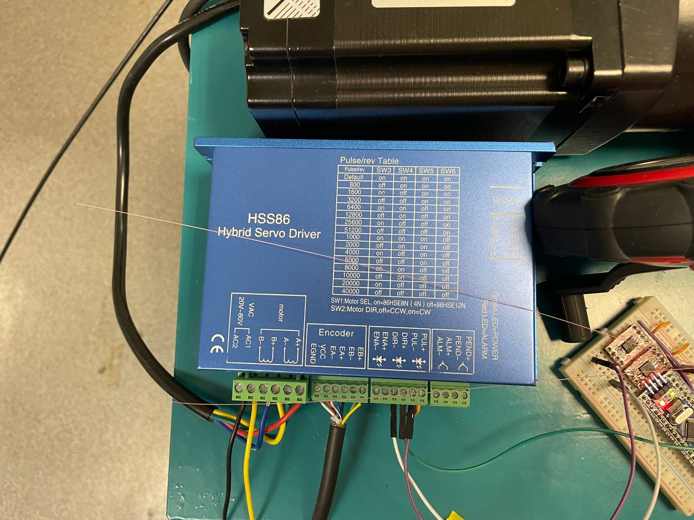
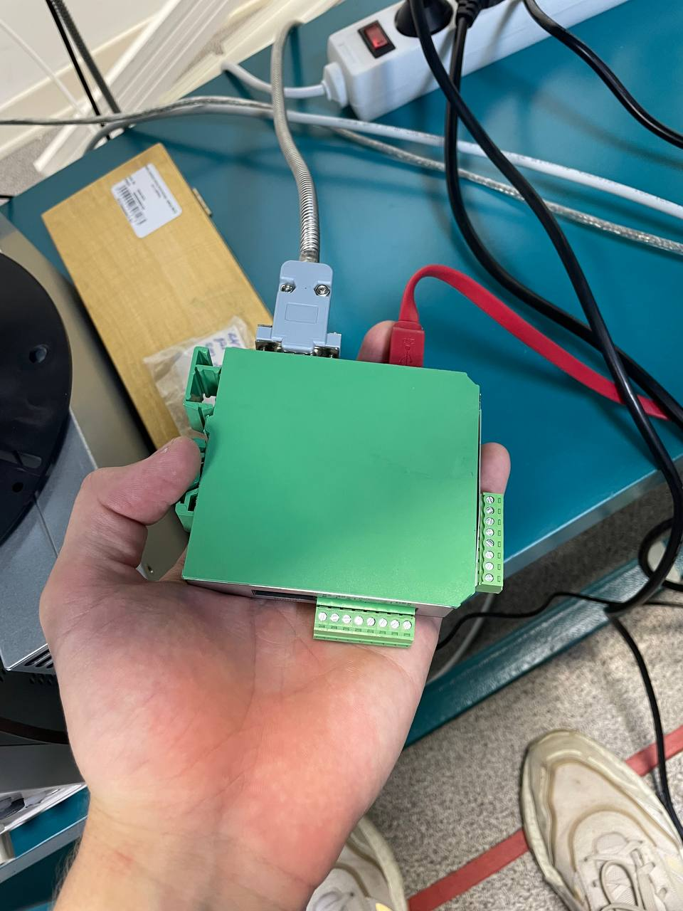
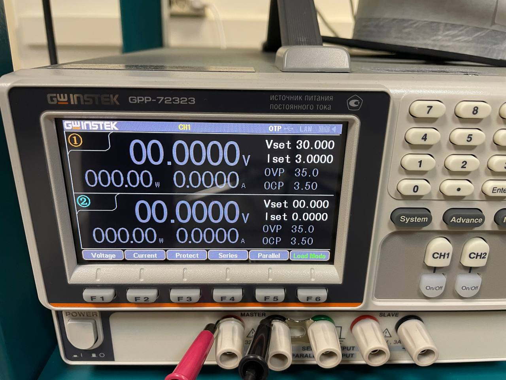

# Деформационный стенд

Проект состоит из физической части, которая располагается в 112, 113 комнатах, и из программной части, расположенной в этой директории.

## Блок схема стенда

## Элементы стенда

### Контроллер управления

### Драйвер управления

### Шаговый двигатель

### Экран-контроллер

### Динамометр

### Контроллер управления линейным энкодером

### Линейный энкодер

## Включение всего стенда

1. Подать питание на [драйвер мотора](#драйвер-управления), для этого на блоке питания выставляем 30В, 3А, как на фото, подключаем к разъёмам AC1, AC2

2. [Контроллер управления](#контроллер-управления) включаем в ПК
3. [Экран/контроллер](#экран-контроллер) подключаем к [динамоментру](#динамометр)
4. [Экран/контроллер](#экран-контроллер) подключаем к ПК, через провод RS232 (розовый такой)
5. [Контроллер управления линейным энкодером](#контроллер-управления-линейным-энкодером) подключаем к [линейному энкодеру](#линейный-энкодер)
5. [Контроллер управления линейным энкодером](#контроллер-управления-линейным-энкодером) подключаем к ПК

## Включение программы управления

1. Надо определить какой COM порт относится к [динамоментру](#динамометр), а какой к [контроллеру управления](#контроллер-управления). Сейчас это COM30 для [контроллера управления](#контроллер-управления) и COM31 для [динамоментра](#динамометр)
2. Зайти в папку *D:\DeformationSternd*, если вы открыли текущший файл, значит вы уже в ней
3. Кликнете дважды на файл *MainWindow.py*
4. Перейдите во вкладку **Настройки -> Настройки соединения**, соотнесите COM порты с устройствами
5. Если всё успешно, то в консоли вы увидете  и в **Модуль получаемых данных** появятся значения

    Теперь вы можете спокойно пользоваться программой

## Важно сделать

1. Необходимо максимально расслабить оптоволокно и выставить на динамометре 0, чтобы всё работало адекватно
2. По стандарту усилие исключающее провисание равно 100Н (10 кг)

## Успешного использования!!!